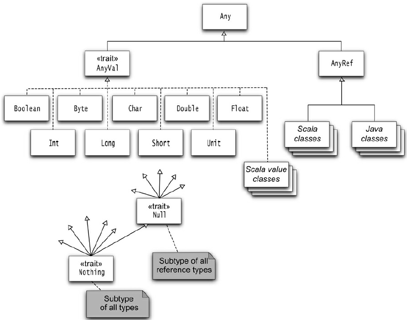

# notes of [Scala for the impatient]

## 基础

* Scala 中数据类型也是 class
  * 7 种数值类型: Byte, Char, Short, Int, Long, Float, and Double
  * Boolean 类型
* 原始类型与 class 类型无区别，可在数字上调用方法（隐式转换为对应的方法调用，如对 Int 操作转为 RichInt 的方法调用等）
  * `1.toString()`
  * `1.to(10)` // Range(1,2,3,4,5,6,7,8,9,10)
* 无封装类型，Scala 自动处理封包拆包，如字符串底层使用的是 java.lang.String
* 隐式转换的 StringOps 对 String 扩展，包含了上百种操作
  * `"Hello".intersect("World")` // "lo"
* 操作符重载，算数操作符也是方法
  * `1 + 2` 等价于 `1.+(b)`
  * 通常 `a.method(b)` 可简写为 `a method b`
* 递增递减，没有 `++` 和 `--` 操作，使用 `+=1` 和 `-=1` 代替
* BigInt 和 BigDecimal 也可直接使用算数运算符
  * `val x: BigInt = 1234567890`
  * `x * x * x` // Java 需要调用方法 `x.multiply(x).multiply(x)`
* `_` 代表通配符，可表达任意东西

## 函数与方法

* 数学函数使用方便简单，如 min, max 不需要调用某个类的静态方法 （通过 `import scala.math._` 导入数学函数包）
* 可省略的 scala 包名前缀，如 `import scala.math._` 可写为 `import math._`
* 无静态函数，与之功能类似的是单例对象；通常一个 class 都会有一个伴生对象，其方法就如同 Java 的静态方法
* 无参方法调用时通常不需要带括号
  * `"Hello".distinct`
* `apply` 方法
  * 伴生对象中定义
  * 像函数调用一样使用，可看做是重载了 `()`
  * `"Hello"(4)` 等价于 `"Hello".apply(4)`

## 控制体系&函数

* 条件表达式
  * `if/else` 表达式有返回值
    * `val s = if (a > 0) 1 else -1` // 这种方式下 s 定义为 val，如果放到判断内部赋值，需要定义为变量 var
    * 统一了三目运算 `?:` 和 `if/else`；Scala 无三目运算
    * `if (a) 1` 等价于 `if (a) 1 else ()`；可以将 `()`(，即 Unit 类) 视为无用值的占位符，可看做 Java 中的 void
  * 无 `switch` 表达式，而是使用更为强大的模式匹配来替代
* 语句终结
  * 分号非必须，单行单表达式可省略，单行多表达式需加分号区分
* 语句块&赋值

  * `{...}` 包含一系列表达式，语句块的结果为最后一个表达式的结果
  * 可用于初始化需要多步操作的值
    * `val a = { express1; express2; express3 }`
  * 赋值语句没有返回值，不可使用链式赋值 `x=y=1` // 与预期结果不一致

* IO

  * 打印，`print / println / printf`
  * 读取 console 输入，`readLine / readInt / readDouble...`

* 循环

  * 不像其他语言那么常用，通常可使用单个方法调用完成所有操作
  * while, do
  * 没有与 Java 类似的 for 循环 `for(init; test; update)`，可使用 while 代替，或者使用 for 表达式
    * `for (i <- 1 to 10) r = r * i`
    * 生成器 `variable <- expression` 会遍历所有元素
    * for 循环可包含多个生成器，逗号分隔（或换行区分），可使用 parttern guard 来进行条件过滤
      * `for(v <- exp1; v2 <- exp2 if(condition)) doSome()` // if 之前的分号可省略
    * for 语句中的变量不需要声明 val 或 var，其类型与迭代的集合中元素类型一致
    * `1 to n` 包含上界，`1 until n` 不包含上界
  * 没有 break，continue 表达式来中断循环，替代方案：

    * Boolean 变量控制
    * 嵌套函数
    * 使用 Breaks 对象的 break 方法

    ```scala
    import scala.util.control.Breaks._
    breakable {
        for (...) {
            if (...) break
        }
    }
    ```

  * yield，在 for 循环体以 yield 开始的形式成为 for 推导式
    * 产生的结果为每次迭代的值的集合
      * `for(i <- 1 to 3) yield i % 3` // Vector(1, 2, 0)
    * 生成的集合与第一个生成器类型一致
      * `for(c <- "hello"; i <- 0 to 1) yield (c+i).toChar` // hieflmlmop
      * `for(i <- 0 to 1; c <- "hello") yield (c+i).toChar` // Vector(h, e, l, l, o, i, f, m, m, p)

* 函数

  * Scala has functions in addition to method
  * `trait Function...` 的实例
  * `technically is an object with an apply method`
  * `def abs(x: Double) = if (x >= 0) x else -x`
  * 必须指定所有参数的类型；返回值为`=`右边的表达式或语句块的最后一个表达式的结果；可省略 `return`
  * 如果是递归函数，则必须指明返回类型
    * `def fac(n: Int): Int = if (n <= 0) 1 else n * fac(n - 1)`
  * 参数默认值和命名参数
    * `def decorate(str: String, left: String = "[", right: String = "]") = left + str + right`
    * 调用时可给部分参数，也可给全部参数，还可通过命名参数传值而不考虑参数顺序
      * `decorate("a")` // [a]
      * `decorate("a", "<<")` // <<a]
      * `decorate(left="<", "a")` // <a
  * 可变参数（本质上是一个 Seq 类型的参数）
    * `def sum(args: Int*) ={var result=0; for (a <- args) result += a; result}`
    * `sum(1,2,3)` // 6
    * `sum(1 to 5: _*)` // 15 当传递序列做为参数时，需要添加 `_*` 告诉编译器传入的为参数序列， 而不是 Int

* 过程 Procedures

  * 无返回值的函数
  * 调用过程通常是为了其副作用，如打印等
  * `def box(s: String) { println(s) }` // 无需要 `=`

* `lazy`

  * 延迟加载，变量定义为 lazy 后，会在第一次访问时才被初始化/执行
  * `lazy val words = scala.io.Source.fromFile("/../words").mkString` // if the program never accesses `words`, the file is never opened
  * 减少初始化消耗、解决循环依赖问题等
  * 会有多余开销：每次使用到 lazy 变量时，都会检查该变量是否已经初始化

* `Exceptions`

  * 无受检异常
  * `Nothing`，throw 表达式的返回类型；在 if/else 表达式中，如果一个分支抛出异常，则 if/else 的返回类型为另一个分支的类型
    * `if (x > 0) f(x) else throw new Exception("xx")`
  * catch 语句块中可使用模式匹配来处理对应类型的异常

    ```scala
    try {
        process(xx)
    } catch {  // 优先匹配原则，将最准确的匹配项放在前面，通用的匹配项放在最后
        case ex: IOException => do1()
        case _ => None
    }
    ```

  * 使用 try/finally 来忽略异常

    ```scala
    preStep()  // 此步出错如何处理？

    try {
        process(oo)
    } finally {
        f()    //  此步出错又如何处理？
    }
    ```

## Arrays

* `Array` 固定长度；`ArrayBuffer` 可变长度
  * `arr.toBuffer`, `buf.toArray`
* 初始化是不要使用 `new`
* 使用 `()` 访问元素
* 使用 `for (elem <- arr)` 遍历元素；倒序 `arr.reverse`
* 使用 `for (elem <- arr if ...) ... yield ...` 转换为新的数组
  * 等价于 `arr.filter(...).map(...)` 或者更简洁 `arr filter { ... } map {...}`
* 与 Java 的数组通用，如果是 `ArrayBuffer`， 可配合 `scala.collection.JavaConversions` 使用
* 在做任何操作前都会转换为 `ArrayOps` 对象
* 构建多维数组
  * `val matrix = Array.ofDim[Double](3, 4)` // 3 行 4 列

## Maps & Tuples

* 创建、查询、遍历 Map 的语法便捷
  * `val scores = Map("a" -> 100, "b" -> 90, "c" -> 95)` 创建的默认为 `immutable` 的 hash map
  * 可变的 Map 需要显式指定 `scala.collection.mutable.Map`
  * 创建空的 Map 需指定类型 `new scala.collection.mutable.HashMap[String, Int]`
  * Map 是键值对的集合，键值对类型可不相同
    * `"a" -> 100` 等价于 `("a", 100)`；创建的另一种写法 `Map(("a", 100), ("b", 90), ("c", 95))`
  * 访问
    * `scores("a")` //返回 Option
    * `scores("d").getOrElse(0)` // 返回实际值
  * mutable 更新
    * 更新值 `scores("a") = 80`
    * 增加元素 `scores += ("d" -> 70, "e" -> 50)`
    * 删除元素 `scores -= "a"`
  * immutable 不可更新，修改时会产生新的 Map， 但公共部分的元素数据是共享的
    * 添加元素会产生新的 Map，`scores + ("d" -> 70, "e" -> 50)`
    * 删除元素产生新的 Map `scores - "a"`
  * 遍历 `for((k,v) <- map) ...`
  * 排序 Map
    * 按照 key 排序存放 `scala.collection.immutable.SortedMap("d" -> 1, "b" -> 2, "c" -> 3)` // Map(b -> 2, c -> 3, d -> 1)
    * 按照插入顺序排放 `scala.collection.mutable.LinkedHashMap("d" -> 1, "b" -> 2, "c" -> 3)` // Map(d -> 1, b -> 2, c -> 3)
* 区分 mutable 和 immutable
* 默认 hash map，也可使用 tree map
* 与 Java 中的 Map 转换方便 `scala.collection.JavaConverters`
  * 在很多时候需要使用 Java 的接口完成任务，但是处理结果时可转换为 Scala 的数据接口来处理更方便，如文件操作等
* Tuples 在聚合操作时很有用
  * Map 中的键值对就是最简单的元组形式 `(k, v)`
  * 类型不必一致 `val a = (1, 3.14, "hello")`
  * 下标访问 `a._1` // 1
  * 模式匹配访问 `val (first, second, _) = a`
  * 用于返回多个值
* Zipping
  * 元组可用于绑定多个值同时处理
  * `zip` 方法

## Classes

* 一个源文件可包含多个类，每个类默认都是 public
* 类字段必须初始化，编译后默认是 private，自动生成 public 的 getter/setter ；[Person 示例](sfti/tmp/Person.scala)
  * `private` 字段，生成 private 的 getter/setter
  * `val` 字段，只生成 getter
  * `private[this]` 字段，不生成 getter/setter
  * 自定义 getter/setter，foo 和 foo\_=
* 类方法默认都是 public
* 方法调用规约：访问器调用可省略括号，修改器调用加上括号
* 为字段加上 `@bean.BeanProperty` 注解可生成符合 JavaBean 规范的 get/set 方法（加上默认的两个方法，共四个方法）
* 构造器：1 个主构造器，任意个辅构造器
  * 全部都叫 `this`，只是参数不同
  * 辅构造器必须调用主构造器或之前定义的辅构造器
  * 主构造器与类定义密不可分，参数直接定义在类名后
  * 主构造器会立即执行类定义中的所有语句
  * 主构造器中的参数被方法使用到，则对应的参数等价于 `private[this] val` 字段
* 内部类
  * 路径依赖，不同于 Java 内部类，同一类 A 的不同实例(a1, a2)构建的内部类 Inner，其类型是不同的，a1.Inner != a2.Inner
  * 解决路径依赖
    * 类型投射，Outer#Inner
    * 将内部类放到伴生对象 object 中
  * `self =>` 自身类型，区分调用的内部类和外部类的字段、方法等

## Objects

* 用于单例及工具类方法
  * object 构造器只在第一次被调用时执行
* 可继承一个 `class` 或多个 `trait`
  * 可用于全局默认对象
* 不可提供构造器参数
* 伴生对象
  * 与类名称一致
  * 类与伴生对象可互相访问私有资源，但区分作用域，如 `Accounts.newUniqueNumber()` 而不是 `newUniqueNumber()`
  * 类与伴生对象必须在同一个源文件中
* 伴生对象中的 `apply` 方法
  * 调用方式 `Object(arg1, ..., argN)`， 返回伴生类的实例，如 `Array(1,2,3)`
  * 省略 `new` 关键字，在嵌套表达式中很方便
* 应用对象
  * `extends App`
  * 不需要 main 方法直接执行构造器内的代码
* scala 默认无枚举类型
  * 使用 `Enumeration` 帮助类实现
  * 枚举类型为 `Enumeration.Value(ID, name)` 内部类， ID 依次累加, 默认 0 开始；name 默认是字段名

## Packages and Imports

* `package` 包名和文件路径并不一定对应
* `java.lang`, `scala`, `Predef` 始终默认会导入
* 与 Java 不同，包路径并不是绝对的，如 `collection.mutable` 实际是 `scala.collection.mutable`
* `package a.b.c` 与 `package a { package b { package c {}}}` 不同
  * `package a` 或 `package b` 中定义的资源可在带括号的包声明中访问，但 `package a.b.c` 无法访问
* 包对象
  * package 由于 JVM 的限制不能直接声明函数或变量
  * 不同于 package， package object 可定义工具函数或常量
* 可见性控制，通过 `private[package.name]` 限制资源的可见性
* `import`
  * 导入包后可使用相对路径访问类等，如 `collection.mutable`
  * 导入所有资源 `import collection.mutable._`
  * 可在任意位置进行导入操作
  * `selector`
    * 选择性的导入一部分成员，`import java.awt.{Color, Font}`
    * 为导入成员取别名：`import java.util.{HashMap => JavaMap}`
    * 隐藏成员： `import java.util.{HashMap => _, _}` // 避免产生混淆
  * 隐式导入，默认导入三个 `java.lang`, `scala` 和 `Predef`
    * 后面导入的可将前面的成员覆盖，避免冲突
    * 导入 scala 相关的包可省略 `scala` 路径

## Inheritance

> `fragile base class` 基类被继承之后，修改基类可能会对子类造成无法预期的影响

* 继承类，与 Java 一样使用 `extends` 关键字
  * `final` 类不能被继承， `final` 字段、方法不能被覆盖
* 覆盖非抽象方法，必须使用 `override` 关键字
* 抽象方法
  * 无方法体的方法，可以省略 `abstract` 关键字；子类覆盖时也可以省略 `override`
* 抽象字段
  * 无初始值的字段，可省略 `abstract` 关键字，子类覆盖式也可省略 `override`
* 调用父类方法，使用 `super` 关键字
* 类型检查和转换， `isInstanceOf`, `asInstanceOf`；获取类型, `classOf`
  * 模式匹配通常是个更好的类型检查方式
* `protected` 不同于 Java，受保护成员在包内不可见
* 辅助构造器不可直接调用超类构造器
  * 可在定义类时直接在 extends 时调用超类构造器并传递参数
  * 继承 Java 类时主构造器必须调用超类的构造器
* 覆盖字段
  * `def` 只能覆盖 `def`
  * `val` 只能覆盖 无参数的 `def`
  * `var` 只能覆盖 抽象的 `var`
* 继承层级

  
  * `Any` 定义了 `asInstanceOf`, `isInstanceOf`，判断相等，hash值等方法
  * `AnyRef` 是除基础类型外所有类的父类，等价于 `java.lang.Object`
    * 提供方法 `wait`, `notify/notifyAll`，`synchronized`
  * `AnyVal` 不包含任何方法，只是个值类型的标记
  * 所有 Scala 类都实现了 `ScalaObject` 这个标记接口，该接口无任何方法
  * `Null` 的唯一实例 `null`，可分配给引用类型，但不可分配给值类型(`Int` 不可为 `null`)
  * `Nothing` 无实例，在泛型构造时有用，`Nil` 类型为 `List[Nothing]`
  * `???` 方法声明返回类型为 `Nothing`， 无返回值，会抛出 `NotImplementedError`，用于预留未实现的方法
  * `Unit` 代表空/`void`，类型唯一值为 `()`
  * 如果方法参数类型为 `Any` 或 `AnyRef`， 当传递多个参数时，会被替换为 `tuple`
* `equals` 和 `hashCode` 判断对象相等
  * 可使用模式匹配实现 `equals`
  * `equals` 参数类型为 `Any` 而不是具体的类型
  * `##` 是 `hashCode` 的安全版本，遇到 `null` 会返回 0 而不是抛出异常
* 值类 Value Class
  * 继承 `AnyVal`
  * 主构造器只有一个参数 val，无构造体
  * 无其他构造器和字段
  * 自动提供的 `equals` 和 `hashCode` 比较实际值
  * 用于隐式转换
    * 其他用途，如 `class a(x: Int, y: Int)` 设计为 `class a(x: X, y: Y)` ，定义值类 `X`, `Y` 避免混淆参数

## Files & RegExp

* 读取所有行 `Source.fromFile({name/java.io.File}).getLines.toArray`，关闭资源 `source.close`
* 读取字符，直接迭代 source
* 读取标准输入 `scala.io.StdIn`
* 读取 URL `Source.fromURL(url, "UTF-8")`
* 读取字符串 `Source.fromString("Hello ww")`
* 读取二进制文件，使用 Java 的库
* 写文件使用 Java 的库
* 序列化 `@SerialVerionUID(42L) class Name extends Serializable`
  * `Serializable` 为 Scala 中的 `trait`
  * 也可省略注解，使用默认的 UID
  * Scala 的集合都是序列化的
* 进程控制
  * 工具包 `scala.sys.process`，包含隐式转换将 `String` 转为 `ProcessBuilder`
  * 执行 shell
    * `"ls -l".!`， `!` 会执行 `ProcessBuilder` 并阻塞直到命令退出并**返回退出码**
    * `"ls -l".!!` 会将**输出作为字符串**返回
    * `#|` 管道： `("ls -l" #| "grep scala").!`
    * `#>` 重定向输出： `("ls -l" #> new File("out.txt")).!`
    * `#>>` 追加：`("ls -l" #>> new File("out.txt")).!`
    * `#<` 重定向输入：
      * `("grep scala" #< new File("out.txt")).!`
      * `("grep html" #< new URL("http://baidu.com")).!`
    * 设置执行目录/环境变量 `Process("ls -l", new File("../"), ("LANG", "en_US")).!`，环境变量为 `(k, v)` 序列
  * 在 Java 项目中执行 Scala 脚本 `ScriptEngine engine = new ScriptEngineManager().getScriptEngineByName("scala")`
* 正则表达式
      * 工具类 `scala.util.matching.Regex`
      * 构造正则对象 `val pattern = "[0-9]+".r`
        * 存在转义、引号等情况时使用 `"""`，`val pattern = """\s+[0-9]+\s+""".r`
      * 捕获组使用括号表示 `val patternName = "([0-9]+) ([a-z]+)".r`
        * 可定义正则变量作为提取器  `val pattern(num, item) = "123 abc"` (`patternName` 与定义的正则名一致)
        * 也可在 for 循环中使用正则变量直接提取捕获组

## Traits

* 替代 Java 中的接口
* 可以有抽象的和具体的方法
  * 在 `trait` 中未实现的方法默认是抽象的 (abstract)
* 类可以实现多个 `trait`，从最后一个开始调用
  * 使用 `extends` 关键字实现
  * 覆盖抽象方法时不需要 `override` 关键字
  * 有多个 `trait` 则对其他的 `trait` 使用 `with` 关键字
* 所有的 Java 接口都可以被当做 `trait` 使用
* 对象也可以添加多个 `trait`，从最后一个开始调用
* 多个 `trait` 的情况下，`super.someMethod` 会根据从右向左的顺序调用下一个 `trait` 的方法
  * 具体调用依赖于使用时的顺序，相比传统的继承更灵活
  * 在多个 mix-in 的情况下，如果父`trait`存在抽象方法，则子`trait`需使用 `abstract override` 关键字，否则 `super.someMethod` 无法编译
* 有初始值的字段/具体字段，都会被添加到子类中
* 无初始值的字段/抽象字段，在非抽象子类中，需要进行初始化
* `trait` 也有构造器
  * 不可以有构造参数，且只有一个构造器
  * 由定义体中的初始化字段和其他语句构成
  * 构造顺序：父类 > 各`trait`从左向右，有父 `trait` 的先构造，共享的父 `trait` 只构造一次 > 子类
  * 考虑到构造顺序，如果子类中使用抽象字段，则可使用提前定义(early definition，会在构造器之前执行)的语法讲改字段初始化
    * 提前定义语句块中只能使用字段定义语句，不可使用其他语句
* `trait` 可继承类，混入该 `trait` 的类都是被继承类的子类，子类如果有继承其他的类也必须是被继承类的子类
* 与自身类型(self type)比较
  * `trait` 不继承类，直接在 body 内定义 `this: Type =>`，则混入的类必须是该 Type 类型的/子类型的
  * 也可使用结构类型(structural type)，`this: { def log(msg: String) } =>` ，则混入的类必须包含结构类型中定义的方法
* `trait` 最终会翻译成类和接口

## Operators

* ```Thread.`yield`()``` 反引号除了用于命名标识符，还可以在调用方法时避免冲突(`yield` 为 Scala 关键字，但也是 `Thread` 的方法)
* 中缀运算符(infix operators)，实际是带两个参数的方法，定义时跟普通方法一样；`a to b` 实际是 `a.to(b)`
* 一元运算符(unary operators)
  * `+, -, !, ~`四个可当做前缀运算符使用，`-a` 实际是 `a.unary_`
  * 如果可放在参数后，则是后缀运算符 `a identifier`
* 赋值操作符(assignment operators)，`a operator= b` 等价于 `a = a operator b`
* 优先性
  * `* / %` > `+ -` > `:` > `< >` > `! =` > `&` > `^` > `|` > 非操作符 > 赋值操作符
  * 中缀运算符优先于后缀运算符
* 结合性
  * 所有操作符都是左结合的，**除了：**
    * 以 `:` 结尾的操作符
      * `1 :: 2 :: Nil` 实际是 `1 :: (2 :: Nil)`
      * 右结合的二元操作符实际是第二个操作对象的方法，如 `2 :: Nil` 是 `Nil.::(2)`
    * 赋值操作符
* 如果 `f(a,b,c)` 调用时 `f` 不是函数或方法，则等价于 `f.apply(a,b,c)`
  * `f(a,b,c) = value` 则等价于 `f.update(a,b,c, value)`；如针对 `HashMap` 的取值和赋值
  * 常用来构建对象时，省略 `new` 关键字
* 提取器 extractors
  * 包含 `unapply` 方法的伴生对象，伴生对象可以定义成给任意类型做为提取器(如，为 String 自定义一个提取器 Name)
  * 在变量定义时使用
  * 在模式匹配中使用
    * `case class` 自动附带 `apply` 和 `unapply` 方法，在模式匹配中会自动调用
  * 提取任意序列值，需要包含 `unapplySeq` 方法，返回 `Option[Seq[Type]]`
    * ~~~**注意**，`unapply` 和 `unapplySeq` 的参数类型不要定义成一样的~~~
* 动态调用 dynamic invocation
  * 定义动态类型
    * `import scala.language.dynamics`
    * 继承 `scala.Dynamic`
  * Scala 处理过程
    * `foo.method("blah")`      ~~> `foo.applyDynamic("method")("blah")`
    * `foo.method(x = 1, 2)`    ~~> `foo.applyDynamicNamed("method")(("x", 1), ("", 2))`
    * `foo.field`           ~~> `foo.selectDynamic("field")`
    * `foo.varia = 10`      ~~> `foo.updateDynamic("varia")(10)`
    * `foo.arr(10) = 13`    ~~> `foo.selectDynamic("arr").update(10, 13)`
    * `foo.arr(10)`         ~~> `foo.applyDynamic("arr")(10)`

## Higher-Order Functions

* `def` 定义的是方法，而不是函数
* 函数可作为变量存在，可直接调用，也可作为值传递给其他函数
* `_` 后缀将普通方法变为函数: `ceil _`
  * 根据上下文编译器可以自动将方法转换为函数，也可省略 `_` 后缀
* 高阶函数，接收函数的函数
* 参数类型推导
  * 匿名函数传递给其他函数或方法时，如果一直到参数类型，则可省略匿名函数的参数类型，可自动推导类型
  * 参数只有一个时可省略括号
    * 当参数在右侧只出现一次时，可使用 `_` 简写
* 闭包 Closures，特定作用域
* SAM, single abstract method interface
  * 对应 Java 中的函数式接口 (1.8)
  * 可将 Scala 函数传递给 Java，**只在函数字面量中起作用**
* 柯里化 Currying
  * 将接收两个参数的函数变为接收第一个参数的函数，该函数返回一个消费第二个参数的函数
* 控制抽象 Control Abstractions
  * Scala 只包含少量的流程控制语句，用户可自定义控制语句

## Collections


* [集合性能对比](http://docs.scala-lang.org/overviews/collections/performance-characteristics.html)
* 多少集合通过 `scala.collection.JavaConverters` 可与 Java 集合互相转换
* 集合区分 generic(`scala.collection`)、mutable(`scala.collection.mutable`) 和 immutable(`scala.collection.immutable`)
  * 如果未明确导入包或使用包路径，默认使用 immutable
* 集合 `trait` 或 `class` 的伴生对象中，都有 `apply` 方法，可直接构造集合实例，如 `Array(1,2,3)`
* `Traversable` 集合层级的顶部，只有 `foreach` 方法是抽象的，其他方法都可直接继承使用
* `Iterable` ，只有 `iterator` 方法是抽象的，其他方法都可直接继承使用
  * 与 `Traversable` 的区别在于，`iterator` [带状态](https://stackoverflow.com/questions/7425370/scala-what-is-the-difference-between-traversable-and-iterable-traits-in-scala-c)（可选择获取下一个元素的时间，在获取下一个元素之前会一直跟踪集合中的位置）
  * `Iterable` 中的 `foreach` 通过 `iterator` 实现
* `Seq` 有序序列，包含 `length`，有固定下标
  * `IndexedSeq` 快速随机访问，通过 `Vector` 实现
  * `LinearSeq` 高效的 `head`/ `tail` 操作，通过 `ListBuffer` 实现
* `Set` 无序集合、无重复元素
  * 默认实现为 `HashSet`，即元素其实是按照对应的哈希值排序的
    * 在 `HashSet` 中查找元素远快于在 `Array` 或 `List` 中查找
* `Map` 键值对集合，`scala.Predef` 提供了隐式转换，可直接使用 `key -> value` 表示 `(key, value)`
  * `SortedMap` 按 key 排序

### Immutable


* `Vector` 带下标的集合，支持快速的随机访问，相当于 不可变的 `ArrayBuffer`
  * 通过高分叉因子的树实现，每个节点包含 32 个元素或子节点
  * 在快速随机选择和快速随机更新之间保持平衡
  * 弥补 `List` 在随机访问上的缺陷

* `Range` 有序的整型集合，步长一致
  * `1 to 10 by 3` 即生成 1 到 10 的序列，步长为 3
  * `util` 不包含上边界，`to` 包含上边界
  * 不存储实际值，只保存 `start`, `end`, `step` 三个值

* `List` 有限的不可变序列
  * 为空 `Nil`，或包含两部分 `head` 元素和 `tail` (子 `List`)
  * `::` 根据给定 `head` 和 `tail` 构建新的 `List`
    * 右结合性，即从右侧开始调用 `1 :: 2 :: Nil` 等价于 `1 :: (2 :: Nil)` // 结果 `List(1,2)
  * 根据 `head`, `tail` 的特性，可很容易进行递归操作
    ```scala
    def multi(l: List[Int]): Int = l match {
      case Nil    => 1
      case h :: t => h * multi(t)
    }
    ```
  * 复杂度
    * 获取 `head`, `tail` 只需要常数时间 `O(1)`
    * 在头部添加元素也只需要常数时间 `O(1)`；可使用 `mutable.ListBuffer` 可在头部 或 尾部进行增/删元素操作
    * 其他操作需要线性时间 `O(N)`

* `SortedSet` 有序集合，按顺序访问元素，默认实现为红黑树

* `immutable.BitSet` 非负整数集合，底层使用 `Long` 数组存储
  * 用较小的整型表示较大的整型，如 3,2,0 二进制表示为 `1101`，即十进制的 13

* `ListMap`
  * 通过键值对的 `LinkedList` 来表示 `Map`
  * 多数情况下比标准的 `Map` 要慢，因此使用较少
    * 只有在获取第一个元素较频繁时才比较有优势 (即 `List` 的 `head`)

* `Stream` 与 `List` 类似，但其元素都是**延迟计算**的
  * 长度无限制
  * 只有请求的元素会被计算
    * 可通过 `force` 来强制进行计算所有元素
  * 通过 `#::` 构造，`1 #:: 2 #:: 3 #:: Stream.empty` 结果为 `Stream(1, ?)` 此处只打印了 `head` 1，而 `tail` 未打印，因为还未计算 `tail`

* `immutable.Stack` LIFO 序列
  * `push` 入栈 , `pop` 出栈, `top` 查看栈顶元素
  * 很少使用，因为其操作都可以被 `List` 包括(`push` = `::`, `pop` = `tail`, `top` = `head`)

* `immutable.Queue` FIFO 序列
  * `enqueue` 入列，可使用集合做参数，一次性入列多个元素
  * `dequeue` 出列，结果包含两部分 `(element, rest)`

### Mutable


* `ArrayBuffer`
  * 包含一个 `array` 和 `size` (继承自 `ResizableArray`)
  * 多数操作速度与 `Array` 相同
  * 可向尾部添加元素 (恒定分摊时间，对于更大的集合也可以高效的添加元素)

* `ListBuffer`，类似于 `ArrayBuffer` 但是基于链表实现

* `LinkedList`
  * 元素包含指向下一元素的链接
  * 空链表元素自己指向自己

* `LinkedHashSet` 除了 Hash 的特点外，会记录元素插入的顺序

* `mutable.Queue`
  * `+=` 添加单个元素；`++=` 添加多个元素
  * `dequeue` 移除并返回队首元素

* `mutable.Stack` 与不可变版本相同，除了会对原数据发生修改

* `mutable.BitSet` 直接修改原数据，更新操作比 `immutable.BitSet` 更高效

### 操作

* 接收一元函数
  * `map` 转换元素，主要应用于不可变集合
  * `transform` 与 `map` 相同，不过用于可变集合，直接转换
  * `collect` 接收偏函数(`PartialFunction`)作为参数；模式匹配也是一种偏函数
  * `groupBy` 按指定函数分组，返回 `Map`
* 接收二元函数
  * `reduceLeft`  从左向右规约 `f(f(f(a, b), c), d)`
  * `reduceRight` 从右向左规约 `f(a, f(b, f(c, d)))`
  * `foldLeft` 提供初始值+二元函数，从左向右折叠，每次计算结果在左侧
    * 可用 `/:`（表示树形左侧）操作符表示，`(init /: collection)(function)`
  * `foldRight` 提供初始值+二元函数，从右向左折叠，每次计算结果在右侧
    * 可用 `:\`（表示树形右侧）操作符表示，`(collection :\ init)(function)`
  * `scanLeft` 和 `scanRight` 结合了 folding 和 mapping，结果为所有的中间过程值
    * `(1 to 10).scanLeft(0)(_ + _) // Vector(0, 1, 3, 6, 10, 15, 21, 28, 36, 45, 55)`
* `zip` 拉链，即将两个集合各个元素像拉链一样交叉结合在一起
  * `List(1,2,3) zip List("a","b","c") // List((1,a), (2,b), (3,c))`
  * 长度不一致的集合则以较小的长度为准
* `zipAll` 为长度较短的集合设置默认值，`this.zipAll(that, thisDefault, thatDefault)`
* `zipWithIndex` 返回元素及对应的下标
* `view` 为集合创建延迟视图
  * 对视图的操作都不会立即计算（包括第一个元素也不会）
  * 与 `Stream` 不同，不会缓存任何值
  * `apply` 方法会强制计算整个视图，使用 `lazyView.take(i).last` 代替 `lazyView(i)`
* `par` 并行化集合，后续应用的方法都会并发计算
  * 很好的解决并发编程问题
  * 将集合变为对于的并行化实现
  * 对于产生的结果，与串行方式的结果一致 （如 `for...yield...`）
  * 可使用 `seq`，`toArray` 等方法将集合还原
  * 部分方法不能并发操作
    * 使用 `reduce` 替代 `reduceLeft`，先对各部分集合操作，然后聚合结果，但操作必须满足结合律
    * 使用 `aggregate` 替代 `foldLeft`，先对各部分集合操作，然后用另一个操作将结果聚合
      * `str.par.aggregate(Set[Char]())(_ + _, _ ++ _)` 等价于 `str.foldLeft(Set[Char]())(_ + _)`

## Pattern Matching and Case Classes

* 可对任何类型进行模式匹配，匹配顺序从上至下
* 模式匹配代替 `switch`，默认分支为 `case _`；可避免 `switch` 语句中因缺少 `break` 带来的 `fall-through` 问题
* 模式匹配也是表达式，可将其返回值直接赋值给变量
* 模式守卫 / guards，为匹配设置条件，任何 `Boolean` 条件都可作为模式守卫；`case ... if ... => ...`
* `case` 关键字后接变量名或对应数据结构中使用变量名，那么匹配项就赋值给该变量，**变量名必须以小写字母开头**
* 使用 `|` 分隔同一匹配的多个可选项，**此时不可使用变量绑定元素**
* 类型匹配，代替 `isInstanceOf` 和 `asInstanceOf`，直接进行类型转换
  * 必须为类型指定变量名，否则匹配的是实际的类型对象
  * 匹配在运行时发生，而 JVM 泛型会被擦除
    * 不可以匹配具体的 `Map` 类型（可使用 `case Map[_, _]`，不可使用 `case Map[Int, Int]`）
    * `Array` 的类型不会被擦除
* 解构 destructuring
  * 匹配数组
    ```scala
    case Array(x, y) => s"$x $y"  // 匹配长度为2的数组，并将分别绑定到 x, y
    case Array(0, rest @ _*) => rest.min // 可变参数
    ```
  * 匹配 `List`
    ```scala
    case x :: y :: Nil => ...  // 绑定参数
    case head :: tail => ...  // 解构 head , tail
    ```
  * 匹配元组
    ```scala
    case (0, _) => ... // 匹配第一个元素为0
    case (x, y) => ... // 绑定参数
    ```
* 定义变量，**注意一定要小写开头**；其实等价于 `match` 模式匹配加上赋值操作
  * `val (x, y) = (1, 2)`
  * `val Array(f, s, rest @ _*) = arr`
* 用于 `for` 循环遍历集合，匹配符合条件的元素

  ```scala
  for ((k, v) <- System.getProperties()) println(s"$k $v")
  // 匹配 value 为 "" 的项，其他的则被忽略
  for ((k, "") <- System.getProperties()) println(k)
  // if guard 过滤
  for ((k, v) <- System.getProperties() if v == "") println(k)
  ```

* Case Class
  * 用于模式匹配的特殊类
  * 构造参数默认为 `val`，默认提供 `apply`、`unapply`、`toString`、`equals`、`hashCode`、`copy`
    * `copy` 用于复制对象时，可使用命名参数来修改属性
  * `case class X` 使用时 `case X() => ...`，需要括号
  * `case object S` 单例，使用时 `case S => ...`， 不要括号
  * `::` 也是 case class，配合中缀表达式，就是常见的匹配方式，`case head :: tail`，实际调用 `::(head, tail)`
  * 可用于嵌套的结构；绑定变量、可变参数匹配类似
  * 适用于固定结构的类，如 `List` 等

* `sealed` 密封的
  * 被修饰的类，则其子类必须和该类在同一个文件中定义
  * 在编译时即确定了所有匹配项的可能性
* `Option` 也是使用 case class 来表示是否有值存在的
  * 子类 `Some` 封装值，子类 `None` 表示无值
  * 相比使用 `""` 或 `null` 更加安全
  * `Map` 进行 `get` 操作返回的也是 `Option`，也可使用模式匹配来处理
  * `getOrElse` 尝试获取值，未获取到则使用给定的值
* Partial Function 偏函数
  * 没有对所有输入进行定义的函数
  * `apply` 从模式匹配中计算函数值，`isDefinedAt` 判断输入是否匹配定义的模式
  * `case` 语句块是偏函数
  * `PartialFunction[A, B]` 的实例， `A` 为输入类型，`B` 为输出类型
    * 可使用偏函数的 `lift` 方法，将偏函数变为常规函数，返回值为 `Option[B]`
    * 也可以通过 `Function.unlift` 将返回 `Option[B]` 的函数变为偏函数
  * `Seq[A]` 也是偏函数 `PartialFunction[Int, A]`
  * `Map[K, V]` 也是偏函数 `PartialFunction[K, V]`
  * `catch` 语句也是偏函数，可在 `catch` 块中使用模式匹配处理异常

## 注解

* Scala 中注解可影响代码编译，如 `@BeanProperty` 会自动生成 `getter/setter`
* 可用于 类、方法、字段、变量、参数等
  * 多个注解无顺序
  * 主构造器的注解，需要加括号 `class Credential @Inject() (var username: String, var password: String)`
  * 表达式的注解，使用分号加注解的方式 `(map.get(key): @unchecked) ...`
  * 类型参数的注解，`class Test[@specialized T]`
  * 实际类型的注解，放在类型之后，`def name: String @Localized`
* 注解实现
  * 注解必须继承 `Annotation`
  * 类型注解必须继承 `TypeAnnotation`
  * 元注解 `@param`, `@field`, `@getter`, `@setter`, `@beanGetter`, `@beanSetter`
* 对应 Java 修饰符、标记接口
  * `@volatile` 对应 `volatile` 关键字
  * `@transient` 对应 `transient` 关键字
  * `@strictfp` 对应 `strictfp` 关键字
  * `@native` 对应 `native` 关键字
  * `@cloneable` 对应 `Cloneable`
  * `@remote` 对应 `java.rmi.Remote`
  * `@SerialVersionUID` 代替序列化字段
* 使用 `@throws(classOf[Exception])` 来处理 Java 中的受检异常
* `@varargs` 处理可变参数
  * `@varargs def name(args: String*)` 生成 `void name(String... args)`
  * 没有 `@varargs` 则可变参数会被转换成 `Seq[T]`
* 优化
  * `@tailrec` 会尝试优化尾递归调用，将其变为循环
  * `@switch` 编译器会检查 `match` 表达式是否编译为 [`ableswitch` 或 `lookupswitch`](http://docs.oracle.com/javase/specs/jvms/se7/html/jvms-3.html#jvms-3.10)，如果被编译成一系列条件表达式，则会抛出异常
  * `@inline`, `@noinline` 建议编译器是否将方法替换为行内调用
  * `@elidable`, 用于标注在生产代码中可移除的方法
    * `elidable` 对象定义了很多级别常量可直接使用，未指定参数时默认是 `SERVERE` 即 1000（包含1000）
  * `@specialized` 处理基础类型，自动生成基础类型对应包装类的方法

## XML

* 直接在代码中使用 XML 字面量
  ```scala
  val doc: Elem = <html><head><title>Test</title></head><body>test</body></html>
  val items: NodeBuffer = <li>item1</li><li>item2</li><li>item1</li><li>item2</li>
  ```
* `Scala` 中的 `Node` 与 `DOM` 不同，不包含父节点信息